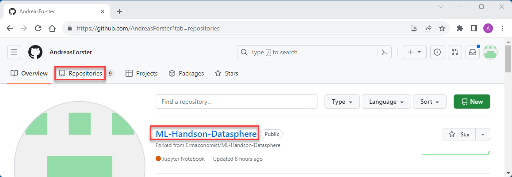

# Fork a Repo

A fork is a new repository that shares code and visibility settings with the original "upstream" repository. Forks are often used to propose changes before they are integrated into the main project.

## About Forks

**We need to fork this repository so you can work with the exericse files provided in you own workspace**

## Forking the ML Repository

1. Navigate to the [ermaconomist/ML-Handson-Datasphere](https://github.com/Ermaconomist/ML-Handson-Datasphere) repository.
1. In the top-right corner of the page, click Fork.

 

3. Under "Owner," select your own username.
4. By default, forks are named the same as their upstream repositories. Optionally, to further distinguish your fork, in the "Repository name" field, type a name.
5. Optionally, in the "Description" field, type a description of your fork.
6. Click Create fork.

*You should now see the forked repository under your account with the name choosen. This is the code you'll execute in the workshop.*

 

*Continue with the next step under [Activate your Codespace](/01_Assets/03-activate-codespace.md).*

 
 

  
More information on how to Fork Setups

  
 

1. [Github Docu on forking](https://docs.github.com/en/get-started/quickstart/fork-a-repo?platform=mac)

