# Log On to SAP Datasphere

Please begin by opening a Chrome browser and enter the SAP Datasphere
URL provided from your Workshop organizers.

[Click here to open the SAP Datasphere
URL](https://academy.eu10.hcs.cloud.sap/)

Enter the following:

Username: provided by instructor

Password: provided by instructor

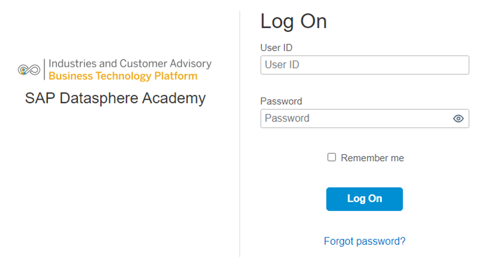 

Then press the Log On button.

**Note:** Delete the Chrome browser cache or open the browser in private
mode (incognito window), to insure you log in with the the correct
credentials.

Expand the **Navigation Menu** in the top left corner to see the full
list of features.

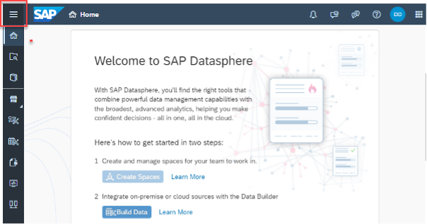 

Collapse to hide the detail again.

 

In the middle of the screen, you'll find some short cuts to the Space
Management and Data Builder, as well as an RSS feed of trending topics
on SAP Datasphere.

 

# Import a Dataset into SAP Datasphere

One way to bring data into SAP Datasphere is by importing flat files. A
flat file is a file that does not contain links to other files or is a
non-relational database. It stands on its own, for instance, like a
single text-only file. The most common flat files are .txt and .csv
files.

SAP Datasphere has two modelling layers tailored for different user
groups: the data layer is the area where data engineers can create their
models with a technical approach, whereas the business layer is the area
for business users who create their models using a more semantic
approach. This allows business users to work independently from data
engineers, while still being able to collaborate and share data with
them.

To access the Data Builder, simply click on the Data Builder icon on the
left-hand side menu of SAP Datasphere.

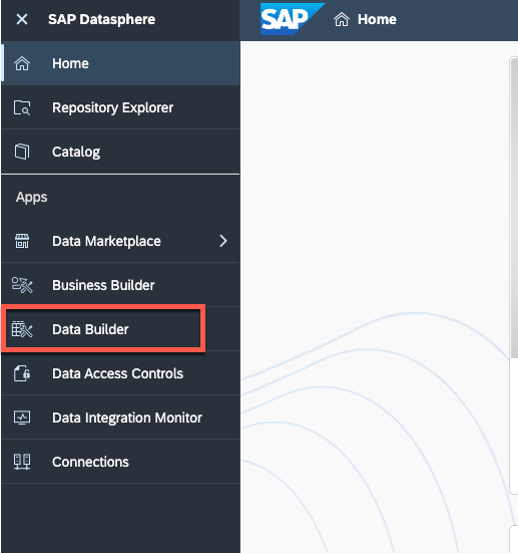 

Now it's time to import the CSV files, so you can get active with SAP
Datasphere. The CSV files are provided by the instructor.

Simply click on the import CSV icon as shown in the image below.

 

Then, select your source file from your system.

Quickly review your data and then click deploy once done.

Give the table a business name and then wait whilst the table is
deployed.

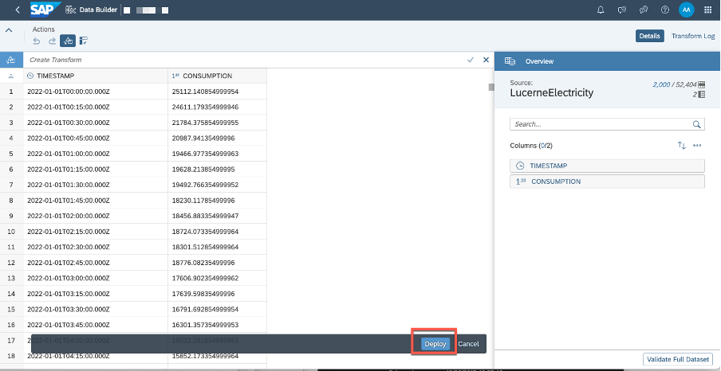 

The deployed table is listed\
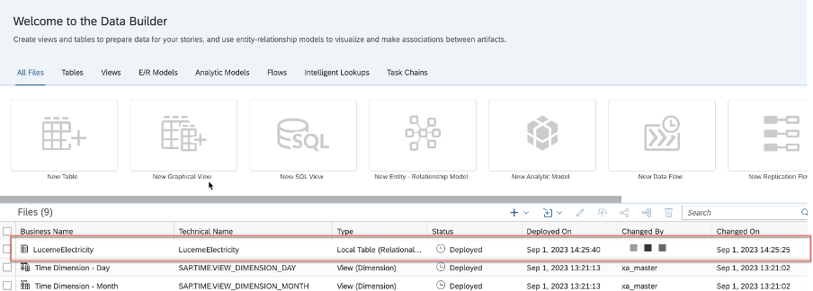 

# Create a Graphical View in SAP Datasphere

With SAP Datasphere, you can use a graphical interface to create data
views. You can drag and drop sources, join them as appropriate, add
other operators to transform your data, and specify measures and other
aspects of your output structure in the output node.

Go to the Data Builder and click on the New Graphical View button.

 

Now that you are in the graphical model builder, it's time to find the
data. As you imported CSV files, your data is under Repository, on the
top right-hand side of the screen.

 

To start building your model, click and drag
the LucerneElectricity table onto the canvas.

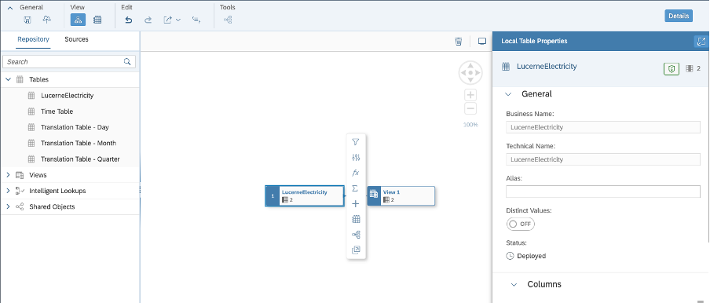 

As you can see, an output node appears on the canvas as soon as your
drop your table in it. The output node is where all of our join table
information will appear once you've completed the model.

Click on the output node and then click on the data preview button to
see a preview of the data.

 

Enable the \"Expose for Consumption\" switch (Reporting Layer) to make a
view available for consumption in SAP Analytics Cloud and other analytic
clients and in ETL and other tools. Only views that have the \"Expose
for Consumption\" switch enabled can be accessed outside the space.

 

Rename the View to V_LucerneElectricity

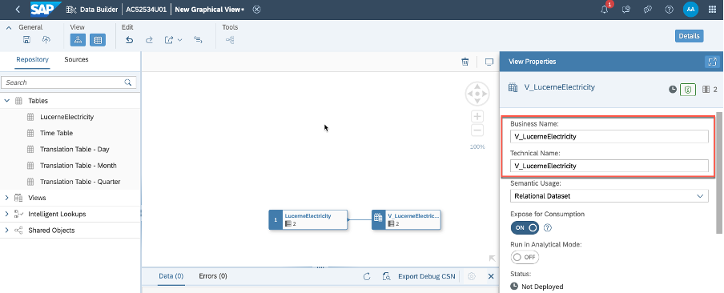 

You have successfully created your graphical view. It is now extremely
important to first save, and then deploy your view. When you save an
object, it is stored in the SAP Datasphere repository, which contains
the design-time definitions of all your objects. When you deploy an
object, you are creating a run-time version for use in the SAP
Datasphere database.

 
  
  # Create New Database User
  
  In this lesson we will create a new User and an associated schema in the
  underlying database. This will allow us access into SAP Datasphere via
  third party tools.
  
  Steps:
  
  Click on Space Management in your system.
  
  If prompted select your space XXXXX .
  
  Verify that you see your Space ID at the top of your Session.
  
   
  
  We will now create a new User and an associated schema in the underlying
  database.
  
  Navigate to the Database Users section of your space and click Create.
  
  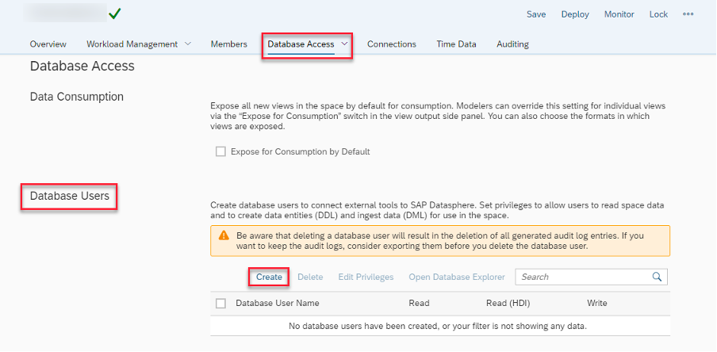 
  
  Name the Database user suffix as OPENSCHEMA.
  
  Check Enable Automated Predictive Library (APL) and Predictive Analysis Library (PAL) [Note that this tick is missing in the screenshot, but you have to select this box]
  
  Check Enable Read and Enable Write Access to the schema. This allows
  external applications to access this schema and exchange data.
  
  Check the box for Enable Read Access (SQL).
  
  Check the box for Enable Write Access (SQL, DDL & DML).
  
  Click Create.
  
  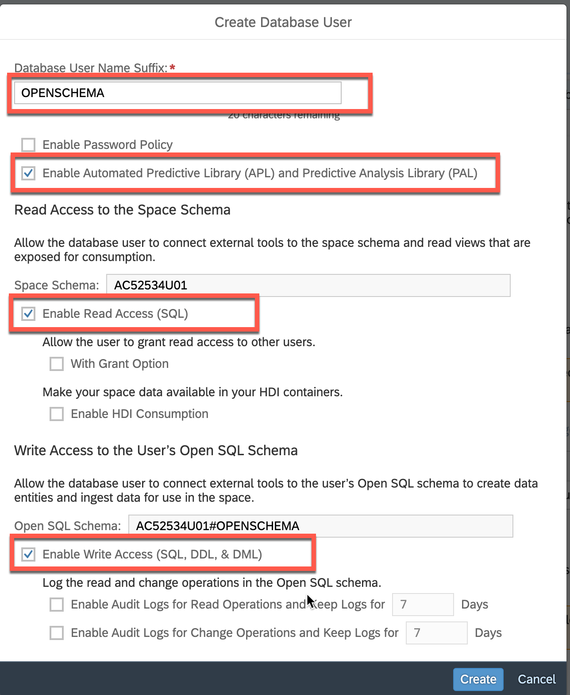 
  
  Now Click Deploy to activate these changes to your space.
  
  **Note**: You may have to wait a few seconds to be notified that the
  Deploymenht was successful before going to the next step.
  
  Once the 'Deployment was Successful' message appears, click on the "i"
  button at the far-right end of the line with your new user on it.
  
  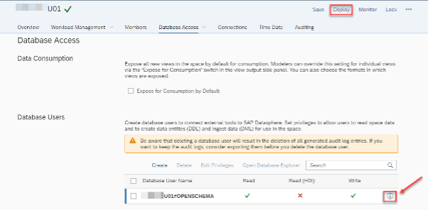 
  
  Note the system-generated Host Name and Port for future use -- this is
  the database host name to connect from third party tools. We will not
  use it further in this exercise... only FYI...
  
  Click on Request New Password.
  
  We want to generate a new password for our Database User.
  
   
  
  Click on the Show Password icon.
  
  Save this password (yours will be different) as it will not be shown
  again (per on-screen instructions).
  
  Save as well the Host Name to your notes. You'll need it later.
  
  Click Close.
  
  **Note**: You will need this password in subsequent steps!
  
   
  
  ## Optional Exercise: Leverage the Database Explorer
  

    
Click here!

    Depending on your system, this could lead to errors.
  
  
    # Log in with Database User
  
  Database Explorer is SAP Datasphere's built-in SQL tool that provides
  access to the underlying Hana database. In this unit, we will be using
  this tool to interact with the new schema we created. You could also use
  your favorite DB management tool like DBeaver, any ETL tool, and even
  3rd party applications to interact with this schema. Data added to this
  schema will be available for Modeling in the Data Builder.
  
  Check the box next to your newly created User.
  
  Click Open Database Explorer.
  
   
  
  Enter the identify provider key value **sdctapoc-platform** in the input
  field.
  
  Click on 'Sign in with alternative identity provider'.
  
   
  
  Enter the password we saved in the Clipboard in an earlier step.
  
  Reduce the Display Name to XXXXXXXXX#OPENSCHEMA (it will default to a
  much longer name with this name appended to the end... delete all the
  other text except for the username).
  
  This will be your database description displayed in Database Explorer.
  
   
  
  Click OK.
  
  Now you are logged in the SAP HANA database explorer. You can use the
  SAP HANA database explorer to query information about the database, as
  well as view information about your database\'s catalog objects.
  
  Here you can find your exposed View.
  
  Right Click on "Views".
  
  Show Views
  
  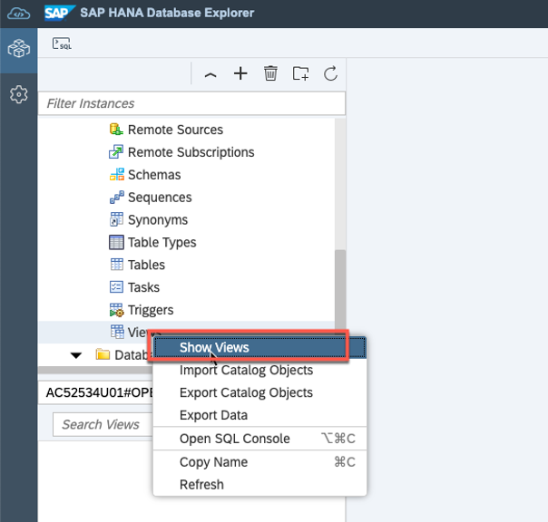 
  
  You can use the filter for an better overview.
  
   

Congratulation, you finished the first part of the exercise.
